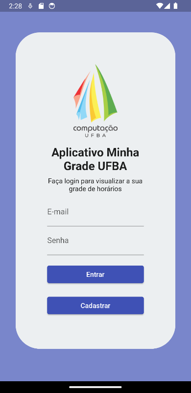
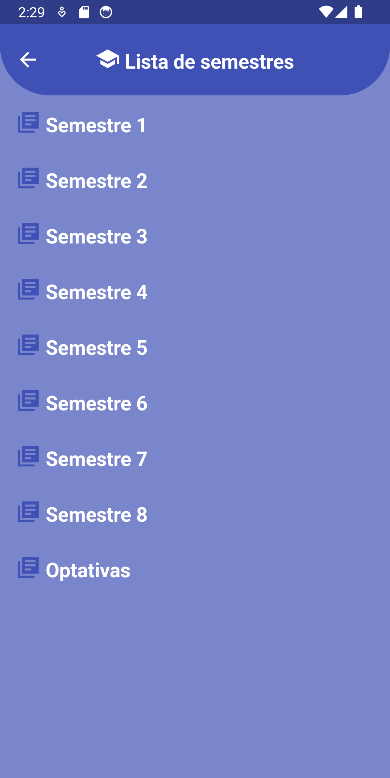
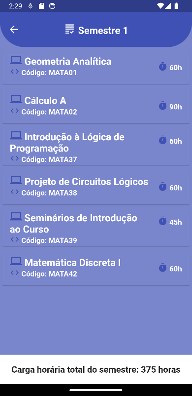
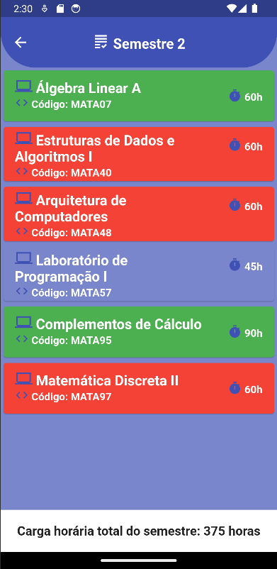

# Minha grade UFBA - Flutter

Aplicativo em Flutter para visualização e criação de grade de matérias na UFBA. Nesse app, é possível criar seu cadastro, selecionar um curso de graduação e guardar registro de matérias já cursadas.

## Como rodar

Entrar na pasta raiz do projeto, digitar no terminal `flutter run` e selecionar a plataforma (Android ou iOS)

## Guia de telas

- Tela de Login/Registrar
- 
- Tela de Home/Seleção de Cursos (Ciência da Computação, Sistemas de Informação, Licenciatura em Computação)
- 
- Tela de Visualização dos Semestres
- 
- Tela de Visualização das Matérias do Semestre
- 
- Marcação contextual das Matérias
  - Verde: Cursada
  - Azul: Disponível
  - Vermelho: Falta Pré-Requisito
- 

## Bibliotecas usadas

- Firebase Authenticator para autenticação de usuários
- SQLite para guardar informação dos cursos no banco de dados

## Membros da equipe 

- Carlos Neto
- Luca Argolo
- Marcos Moreira
- Débora Carvalho
